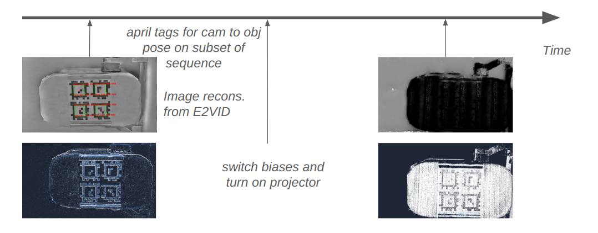
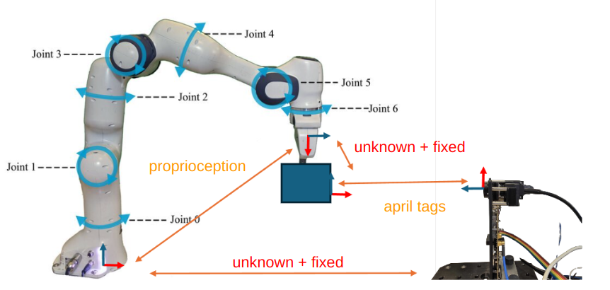

## Recording
1. Print the april tag layout in `april_tag_layout.svg` and stick it onto an object with a CAD model. 
2. Place this object into the robot grippers. 
3. Move the robot in front of event camera/projector without projector on.
4. Turn on projector and change event camera biases.
5. Move the robot at high speeds etc.

## Data Preparation
Prepare a folder `$DATADIR` with 
- kalibr calibration file `calibration.yaml`
- DOE file `DOE_extended.npy`
- recorded events from above `data.raw`
- recorded robot state `robot.bag`
- CAD file `cad.ply`
Example data can be downloaded [here](https://drive.google.com/file/d/1jKFV0HTxeXDTqocmWin70RttF-i-oD2O/view?usp=sharing).

### Data Collection Timeline 


### Transforms 


## Data Processing
1. Reconstruct images from events using [e2calib](https://github.com/uzh-rpg/e2calib). We will use these images to detect
april tags in the event stream, and we will use these detections to find the object pose over time.

    ```bash
    python convert.py $DATADIR/data.raw
    python offline_reconstruction.py --h5file $DATADIR/data.h5 \
                                             --height 720 --width 1280 \
                                             --freq_hz 50 --use_gpu -o $DATADIR/e2vid/
    ```
    Extract april tags from images, and determine the object pose within the camera frame. 
    ```bash
    python scripts/april_tag_trajectory.py --images_folder $DATADIR/e2vid/e2calib/ \
                                   --calibration_file $DATADIR/calibration.yaml \
                                   --output $DATADIR/april_tags.tum \
                                   --detections $DATADIR/detections.npy
    ```

2. Determine the gripper pose of the robot. We export the bag file to a TUM trajectory format.
This trajectory is used to determine the object pose while the projector is on, and april tag detections are not 
feasible to get from the event stream. We get this trajectory by first performing temporal alignment, and then hand-eye 
calibration
    ```bash
    python scripts/manipulator_pose_export.py --arm franka --bagfile $DATADIR/robot.bag \
                                              --root-times --output $DATADIR/robot.tum
    ```

    Temporally align robot trajectory to april-tags trajectory
    ```bash
    python scripts/temporal_alignment.py --reference $DATADIR/april_tags.tum \
                                         --trajectory $DATADIR/robot.tum \
                                         --output $DATADIR/robot_temporally_aligned.tum
    ```
    Spatially align the trajectory via Hand-eye calibration
    ```bash
    python scripts/hand_eye_calibration.py --target $DATADIR/april_tags.tum \
                                           --trajectory $DATADIR/robot_temporally_aligned.tum \
                                           --detections $DATADIR/detections.npy \
                                           --kalibr-file $DATADIR/calibration.yaml \
                                           --output $DATADIR/robot_spatiotemporally_aligned.tum 
    ```
3. Generate scans from the projector sequence. Use the [SSS package](https://github.com/k-chaney/sss_projector/tree/daniel/sony). We will transform these points into the april tags frame, and then estimatepoint clouds from events and projector
the relative transform between april tags and CAD frame via ICP. Generate scans first
   ```bash
   python scripts/run_experiment_it.py --file $DATADIR/data.raw \
                                       --doe-file $DATADIR/DOE_extended.npy \
                                       --sleep-ms 0 --output $DATADIR/projector_scans/ \
                                       --kalibr-file $DATADIR/calibration.yaml
   ```
   Express all projector scans in april tags frame
   ```bash
   python scripts/remap_scans_to_april_tags_frame.py --scans $DATADIR/projector_scans/lut/ \
                                                     --trajectory $DATADIR/robot_spatiotemporally_aligned.tum \
                                                     --output $DATADIR/projector_scans/lut_remapped/
   ```
   Align these "static" point clouds to CAD to find the relative orientation
   ```bash
   python scripts/align_cad_with_static_pc.py --scans $DATADIR/projector_scans/lut_remapped/ \
                                              --cad-file $DATADIR/cad.ply \
                                              --output $DATADIR/pose_cad_april_tags.npy
   ```
4. Generate the virtual GT point clouds from moving the CAD model according to all the generated transforms. 
These points are in 1-to-1 correspondence with each other, and thus scene flow can be calculated by loading two corresponding 
point clouds and taking their difference.
   ```bash
   python scripts/generate_gt_scans.py --trajectory $DATADIR/robot_spatiotemporally_aligned.tum \
                                                      --cad-file $DATADIR/cad.ply \
                                                      --pose-cad-static $DATADIR/pose_cad_april_tags.npy \
                                                      --output $DATADIR/ground_truth/
   ```


